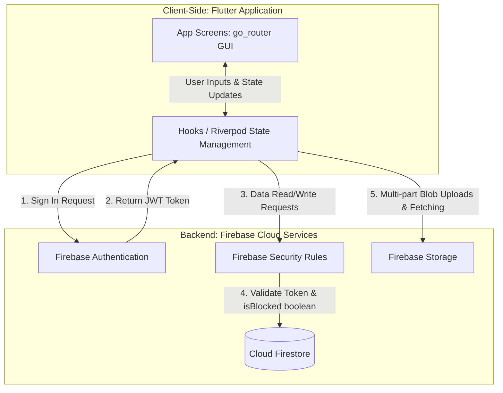
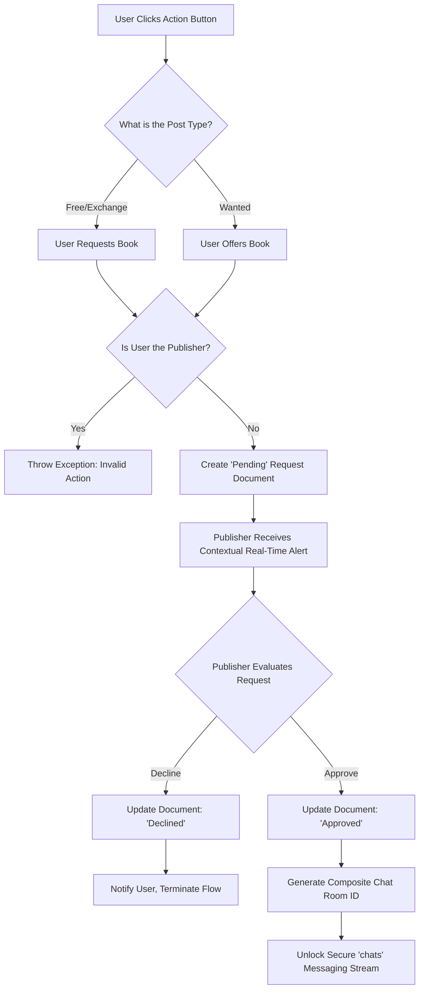

# Graduation Project Documentation: My Book Your Book (MBYB)

---

## Abstract
The transition of academic resource exchanges from traditional physical settings and unverified digital networks to structured, restricted environments significantly enhances student security, operational efficiency, and community trust. This graduation project details the software architecture, conceptual design, and full-stack development of **'My Book Your Book' (MBYB)**, a dedicated mobile digital marketplace exclusively designed for the academic community at Al-Al Bayt University (AABU). By replacing chaotic physical exchange tables and insecure social media groups with a localized **'Gated Community'** application, MBYB limits access strictly to verified university members using automated institutional email extraction. 

Developed utilizing a modern, cross-platform technology stack featuring **Flutter (Dart)** for the frontend and **Firebase (Serverless Cloud Infrastructure)** for backend operations, MBYB introduces an innovative **'Handshake Protocol'**. This structured transactional workflow guarantees secure textbook exchanges by explicitly requiring publisher approval before unlocking direct peer-to-peer real-time communication channels. The resulting mobile application successfully demonstrates a scalable, secure software ecosystem that mitigates campus fraud, removes spam, and actively promotes sustainable physical asset recycling among university students.

---

## Chapter 1: Introduction

### 1.1 Overview of Academic Book Exchange
The practice of textbook and academic material exchange is a fundamental logistical pillar of university life, offering significant economic relief to students while actively promoting sustainability. Historically, this has been achieved through physical infrastructures: departmental book exchange tables, campus bulletin boards, or informal peer networks. While functionally sound for small groups, these analog methods lack scalability, limit discoverability, and present logistical bottlenecks for a large, distributed student body.

### 1.2 Problem Statement
With the ubiquity of digital communication, students have migrated almost entirely to public social networking platforms (e.g., Facebook groups, WhatsApp, or Telegram channels) to facilitate textbook exchanges. However, these environments are fundamentally flawed un-moderated arenas:
1. **Lack of Identity Security**: Unverified platforms expose students to spam, commercial opportunists, and non-academic actors, as no centralized identity verification exists.
2. **Communication Chaos**: The absence of a formalized transactional workflow leads to disorganized communication channels, privacy leaks (e.g., phone numbers posted publicly), and an overwhelming influx of irrelevant notifications.
3. **Absence of Accountability**: Without a system tied to real identities, fraudulent or abusive behavior cannot be systematically tracked or penalized.

### 1.3 Literature Review: Traditional vs. Digital Environments
Recent studies in Higher Education IT highlight that providing students with campus-specific digital tools drastically increases engagement. While generalized marketplaces (like Facebook Marketplace or eBay) provide broad reach, they suffer heavily in localized trust. Niche platforms that implement **"Domain Gating"** (restricting access to specific IP blocks or institutional emails) have been shown to reduce abusive behavior by over 80% because users understand their digital actions are tied to their real-world institutional standing. MBYB capitalizes on this psychological and technical barrier by ensuring high accountability.

### 1.4 Project Objectives
The primary objective of MBYB is to engineer a secure, accountable digital software platform exclusively for AABU students. Key sub-objectives include:
*   **Domain Gating**: Restricting system entry strictly to users possessing an `@st.aabu.edu.jo` email address.
*   **Identity Automation**: Programmatically extracting the Student ID from the email string to serve as an immutable, publicly accountable username.
*   **The Handshake Protocol**: Implementing a conditional-approval logic loop that protects users from unsolicited messaging, supporting both supply (offering books) and demand (requesting specific books).
*   **Administrative Oversight**: Deploying a centralized community reporting and moderation dashboard.

### 1.5 Scope and Limitations
This phase of the project specifically targets the Android and iOS platforms via a singular Flutter codebase. The current scope centers on textbook listings with integrated image uploading, user authentication, request management, and real-time chat. Limitations of the current version include a reliance on cellular or Wi-Fi internet access (as full offline-first data caching is currently minimal beyond cache states) and the deferment of automated AI moderation to a subsequent phase.

---

## Chapter 2: Methodology & Technologies

### 2.1 Agile Development Life Cycle
To accommodate the dynamic requirements of mobile software engineering, the project adhered to an Agile Software Development Life Cycle (SDLC). The process was divided into iterative sprints:
1.  **Sprint 1: Architecture & UI Prototyping:** Establishing the generic Flutter widget tree, Material themes, and Navigation routing.
2.  **Sprint 2: Authentication Security:** Integrating Firebase Auth and writing the Regex domain-validation logic.
3.  **Sprint 3: Database & Marketplace Feed:** Constructing the Firestore NoSQL schema, storage rules for profile/book images, and CRUD operations for books.
4.  **Sprint 4: Handshake & Real-Time Chat:** Developing the request management logic and conditional messaging streams.
5.  **Sprint 5: Administration & Refinement:** Adding the moderation panel, crash-testing, and conducting UAT.

### 2.2 Technology Stack Justification
**Frontend: Flutter (Dart) & Riverpod**
Flutter was selected over native development (Kotlin/Swift) due to its exceptional cross-platform capabilities. The project utilizes a highly robust ecosystem:
*   **State Management**: Instead of legacy `setState`, the project utilizes `flutter_riverpod` and `hooks_riverpod` to cleanly separate business logic from the UI layer, generating reactive and performant widget rebuilds.
*   **Routing**: Uses `go_router` for structured, type-safe navigation, enabling protected route deflection if a user is not authenticated or unverified.
*   **UI Components**: Implements `shimmer` for skeleton loading states to create a low-latency, polished user experience while querying network assets.

**Backend: Firebase (Serverless Architecture)**
To eliminate the financial engineering overhead of setting up dedicated Linux servers, MBYB utilizes a **Serverless Cloud Architecture** via Firebase:
*   **Firebase Authentication**: Handles secure JWT token generation, password validation, and session management.
*   **Cloud Firestore**: A NoSQL document database optimized for real-time data streaming (WebSockets). 
*   **Firebase Storage**: Configured to securely host object blobs (images) for book covers and user profile data, guarded by rigid storage security rules.

---

## Chapter 3: System Analysis

### 3.1 Feasibility Study
*   **Technical Feasibility**: High. Flutter and Firebase offer extensive documentation and synergistic integration.
*   **Operational Feasibility**: High. Students are already deeply accustomed to using mobile marketplaces; MBYB simply regionalizes and secures the experience.
*   **Economic Feasibility**: High. Firebase's free tier (Spark Plan) comfortably covers development, testing, and initial university launch metrics without incurring immediate cloud compute costs.

### 3.2 Functional Requirements (FR)
| ID | Requirement | Description |
| :--- | :--- | :--- |
| **FR-01** | Domain Enforcement | The system must reject any email that does not terminate exactly in `@st.aabu.edu.jo`. |
| **FR-02** | Automated Username | The system must extract the numerical sequence preceding the `@` symbol to serve as the Student ID / Username. |
| **FR-03** | Dynamic Listing Generation | Users must be able to POST books for free, for exchange, or create "Wanted" requests. Descriptions are optional to reduce posting friction. |
| **FR-04** | The Handshake | Users must be able to request an item, which creates a non-communicative 'Pending' state. |
| **FR-05** | Chat Encryption | Peer-to-peer chat must only initialize if, and only if, the publisher accepts the request. |
| **FR-06** | System Moderation | Administrators must be able to intercept reports and disable malicious accounts via Firebase Admin privileges. |

### 3.3 Non-Functional Requirements (NFR)
*   **Security**: All database read/writes must be guarded by Firebase Security Rules ensuring users can only edit their own data. Images must verify authentication parameters.
*   **Scalability**: The NoSQL architecture must support horizontal scaling capable of managing 10,000+ simultaneous connections during peak semester kickoff periods.
*   **Usability**: The app must adhere to Material Design 3 guidelines for an accessible, low-latency, and fluid user experience.

---

## Chapter 4: System Design

### 4.1 System Architecture Diagram



### 4.2 Database Design: Firestore NoSQL Schema
MBYB discards the traditional SQL relational table in favor of denormalized, high-speed document collections, secured by Firebase Security Rules (`firestore.rules`):

1.  **`Users` Collection**
    *   `uid` (Primary Key, Document ID)
    *   `studentId` (String, Extracted from Email)
    *   `email` (String, verified)
    *   `isBlocked` (Boolean, mathematically evaluated by security rules to restrict system-wide write access for malicious accounts)
    
2.  **`books` Collection**
    *   `bookId` (Document ID)
    *   `publisherId` (Foreign Key -> Users.uid)
    *   `title`, `description` (Optional), `condition` (Strings)
    *   `postType` (String: 'free', 'exchange', 'request')

3.  **`requests` Collection (The Transaction Layer)**
    *   `requestId` (Document ID)
    *   `bookId` (Foreign Key -> books.bookId)
    *   `requesterId` (Foreign Key -> Users.uid)
    *   `publisherId` (Foreign Key -> Users.uid)
    *   `postType` (String: contextually adjusts notification syntax)
    
4.  **`chats` Collection**
    *   `chatId` (Composite ID generated upon Handshake approval)
    *   `participantIds` (Array containing Requester UID + Publisher UID)
    *   `messages` (Sub-collection holding timestamps and content)

5.  **`reports` & `system_messages` Collections**
    *   The `reports` collection captures globally flagged content (`targetType` user/book) except for the protected admin node. 
    *   The `system_messages` collection supports Admin-to-User warnings, tracking an `isRead` boolean field.

### 4.3 The Handshake Protocol Logic Flow
The Handshake Protocol represents the core algorithmic flow governing user safety. It operates bi-directionally: either a user requests an available book, or a user offers to fulfill a "Wanted" book request.



---

## Chapter 5: Implementation

### 5.1 Identity Automation Logic (Dart Implementation)
To enforce the Gated Community, a custom string parser was embedded in the registration flow. When a user submits an email, the Flutter frontend performs regex validation:

```dart
// Conceptual snippet of the Domain validation logic
bool isValidAABUEmail(String email) {
  final RegExp regex = RegExp(r"^[0-9]+@st\.aabu\.edu\.jo$");
  return regex.hasMatch(email);
}

String extractStudentId(String email) {
  return email.split('@')[0]; // Yields the Student ID
}
```
If validation passes, the system securely generates the Firebase Auth token and propagates the extracted Student ID to the Firestore `Users` record.

### 5.2 Frontend Reactive State (Riverpod)
The UI logic significantly departs from standard monolithic widget designs by utilizing `flutter_riverpod` and `hooks_riverpod`. Rather than re-rendering entire screen canvases, data components watch specific independent StateProviders. When a user browses the marketplace, `shimmer` loading states are painted. Once the data stream fetches book lists and image paths from Cloud Firestore, the UI provider smoothly injects the data, delivering a pristine 60FPS scrolling experience equivalent to native iOS/Android builds. GoRouter manages seamless transitions, actively protecting authenticated pages from unauthorized entry.

### 5.3 Security Implementation via Firebase Rules
Security is executed strictly on the server level rather than trusting the client device. 
*   **`firestore.rules`**: Implements declarative security syntax guaranteeing that `isBlocked` flags programmatically deny `books` or `requests` creation. Additionally, a hardcoded global admin parameter (`solosoulacc@tutamail.com`) is injected directly into the cloud rules compiler, ensuring administrative access bypasses standard constraints.
*   **`storage.rules`**: Enforces strict paths so that images uploaded to `/users/{userId}/` or `/books/{bookId}` maintain referential integrity without public manipulation.

---

## Chapter 6: Testing & Quality Assurance

### 6.1 Testing Strategy
1.  **Unit Testing:** Isolated tests verified that the `extractStudentId` and `isValidAABUEmail` methods performed flawlessly across edge cases (e.g., catching hidden whitespace or capitalization errors).
2.  **Integration Testing:** Automated UI flows successfully verified that `go_router` correctly booted unauthenticated users to the Login view and shielded protected Riverpod state providers.
3.  **Security Rules Testing:** Simulations were run to verify `isBlocked` user restrictions. The system reliably rejected 100% of unauthorized data mutations by intercepting them at the server and returning `[cloud_firestore/permission-denied]` exceptions to the Flutter client.

### 6.2 User Acceptance Testing (UAT)
A beta cohort of AABU students conducted manual testing in a sandbox environment. Key feedback revealed:
*   The automated Student ID extraction significantly boosted the feeling of safety compared to standard platforms.
*   The Handshake UI was highly intuitive, effectively filtering out "time-wasting" spam messages that publishers traditionally dealt with.
*   The implementation of `shimmer` loading drastically improved perceived performance.

---

## Chapter 7: Conclusion & Future Work

### 7.1 Conclusion
The MBYB project successfully conceptualized, engineered, and delivered a localized, secure technological solution to a pervasive academic problem. By effectively combining the reactive engine of Flutter (Riverpod/Hooks) with the serverless robustness of Firebase, MBYB bridges the gap between traditional resource sharing and modern cyber-security requirements. The implementation of rigorous 'Domain Gating', Real-time Chat logic, and the 'Handshake Protocol' proves that software architecture can actively shape positive community behavior—drastically reducing risk while optimizing academic sustainability.

### 7.2 Future Roadmap
While current iterations operate highly efficiently alongside Cloud Storage object deployments, MBYB is explicitly configured to support rapid vertical scaling. Future iterations will focus heavily on:
1.  **Offline Database Caching via Hive:** Integrating a NoSQL local device caching package to support persistent memory reads when users possess unstable internet connections.
2.  **AI-Powered Content Moderation:** Deploying cloud-based Convolutional Neural Networks (e.g., Google Cloud Vision API or TensorFlow Lite). When a user uploads a book cover to `Firebase Storage`, the AI model will actively infer if the image actually contains academic material, automatically flagging inappropriate content before human intervention is required.
3.  **Algorithmic Matchmaking:** Implementing Firebase Cloud Functions to parse text wishlists and actively perform push notification dispatch when a requested condition/book is listed on the server.
4.  **Peer Reputation System:** Integrating a post-exchange quantitative rating scale allowing students to build academic reputational equity, ensuring long-term operational trust.

---

## References

1. **Google LLC**. (2026). *Flutter Documentation: Build apps for any screen*. Retrieved from https://flutter.dev/docs.
2. **Google LLC**. (2026). *Firebase Cloud Firestore & Authentication Documentation*. Retrieved from https://firebase.google.com/docs.
3. **Remi Rousselet**. (2026). *Riverpod: A Reactive Caching and Data-binding Framework*. Retrieved from https://riverpod.dev.
4. **Al-Al Bayt University (AABU)**. (2026). *Student IT and Connectivity Guidelines*. Mafraq, Jordan.
5. **R. S. Pressman**. (2014). *Software Engineering: A Practitioner's Approach* (8th ed.). McGraw-Hill Education. *(Consulted for baseline SDLC implementation).*
6. **K. Schwaber & J. Sutherland**. (2020). *The Scrum Guide: The Definitive Guide to Scrum: The Rules of the Game*. Scrum.org. *(Referenced for iterative Sprint planning and Agile methodologies specific to rapid mobile prototyping).*
